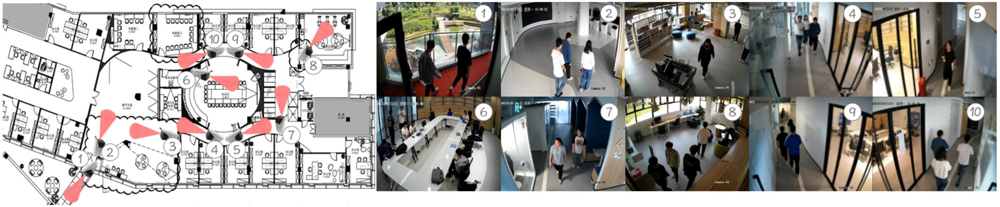

# BNBU-MTMC
BNBU-MTMC is a comprehensive indoor Multi-Target Multi-Camera (MTMC) person re-identification dataset specifically designed for indoor surveillance scenarios.

## Dataset Characteristics

### Environment
- **Location**: T4 building, Beijing Normal University-Hong Kong Baptist University (BNBU) campus
- **Setting**: Diverse indoor environments including lobbies, offices, meeting rooms, pantries, and lounges
- **Cameras**: 10 strategically positioned cameras (C1-C10) with varying heights and angles

## Dataset Collection Environment

<div align="center">

<p><strong>Figure 1:</strong> Overview of the BNBU-MTMC dataset collection environment showing the detailed floor plan and representative frames from all 10 cameras</p>
</div>

The left side shows the detailed floor plan of the T4 building, illustrating the strategic placement of cameras across various indoor locations. The layout showcases the complexity of the environment, including corridors, open spaces, meeting rooms, and entry/exit points. The right side presents representative frames from all 10 cameras, demonstrating the diverse perspectives and scenes captured within the building.

## Dataset Comparison

<div align="center">

<p><strong>Figure 2:</strong> Comparison of BNBU-MTMC with other prominent ReID datasets, highlighting unique indoor challenges</p>
</div>

Our dataset showcases unique indoor challenges compared to popular outdoor datasets (Market1501, DUKE, CUHK03):
- **(a) Occlusions**: Various obstructions common in indoor environments
- **(b) Lighting Changes**: Diverse illumination conditions across different indoor spaces  
- **(c) Poses**: Wide range of human postures and activities specific to indoor settings
- **(d) Camera Placements**: Variety in camera angles reflecting complex indoor layouts

 
## Download

📁 Google Drive:  https://drive.google.com/drive/folders/1IyLQwJZg16BwdbqmUqmPg9Xzzf_upIOE?usp=sharing

## Citation

If you use this dataset in your research, please cite our paper:

```bibtex
@article{wu2025edgenet,
 title={EdgeNet: A Distributed Network Architecture for Real-Time Person Re-identification with Dynamic Load Balancing},
 author={Wu, Shangrui and Li, Yupeng and Guo, Jianxiong and Fan, Wentao and Wang, Wenhua and Wang, Tian},
 booktitle={IEEE/ACM International Symposium on Quality of Service},
 year={2025}
}

@article{wu2025enhancing,
  title={Enhancing Collaborative Inference on Heterogeneous Edge Devices via Adaptive Ensemble Knowledge Distillation},
  author={Wu, Shangrui and Li, Yupeng and Wang, Wenhua and Guo, Jianxiong and Fan, Wentao and Liu, Qin and Jia, Weijia and Yu, Shui and Cao, Jiannong and Wang, Tian},
  journal={IEEE Journal on Selected Areas in Communications},
  year={2025},
  publisher={IEEE}
}

@article{li2025e2ec,
  title={E2EC: Edge-to-Edge Collaboration for Efficient Real-Time Video Surveillance Inference},
  author={Li, Guo and Zeng, Jiandian and Peng, Zihao and Liang, Yuzhu and Zheng, Xi and Wang, Tian},
  journal={IEEE Transactions on Mobile Computing},
  year={2025},
  publisher={IEEE}
}
```

## Acknowledgments
We gratefully acknowledge the support and resources provided by the Engineering Research Center of Cloud-Edge Intelligent Collaboration on Big Data at Beijing Normal University, which made this research possible.
